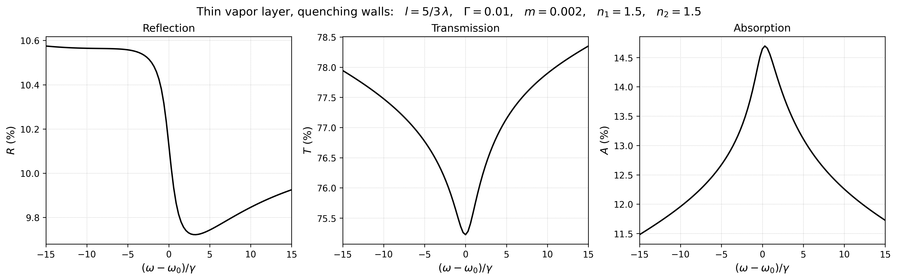
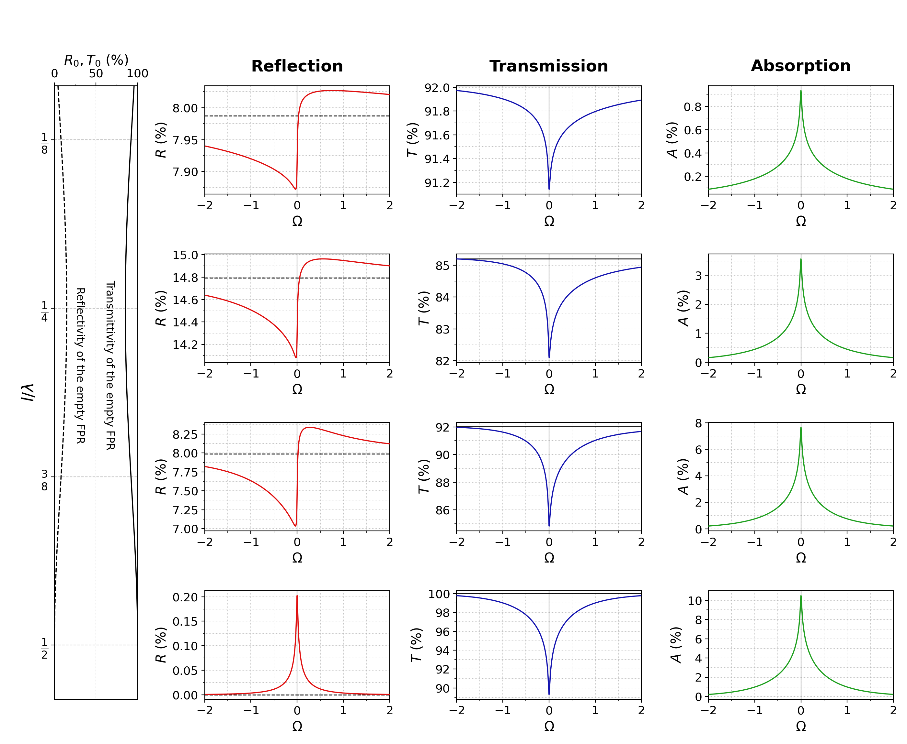

# tvl-spectra

Reflection, transmission and absorption spectra of a thin atomic vapor layer between two dielectric windows, computed in the linear regime with quenching of the atomic polarization at the walls. The layer can be anywhere from a fraction of a wavelength to a few wavelengths thick, and the solution is exact in the optical density of the vapor (no perturbation expansion).

The model is that of A. V. Ermolaev and T. A. Vartanyan, Phys. Rev. A **105**, 013518 (2022) extended to non-perturbative treatment.



## Quick start

Requires Python ≥ 3.7 with NumPy and Matplotlib, plus Jupyter to run the notebook (tested with Python 3.7, NumPy 1.21, Matplotlib 3.5).

```bash
pip install -r requirements.txt
jupyter notebook example.ipynb
```

The notebook sets the parameters, computes the three spectra and plots them. The same in plain Python:

```python
import numpy as np
import tvl

Gamma = 0.01
Omega = np.linspace(-10, 10, 201) * Gamma          # detuning in units of k v_T
R, T, A = tvl.spectra(l_lam=5/3, Omega=Omega, Gamma=Gamma, m=0.001, n1=1.5, n2=1.5)
fig, axes = tvl.plot_spectra(Omega, R, T, A, l_lam=5/3, Gamma=Gamma, m=0.001, n1=1.5, n2=1.5)
```

## Parameters

All parameters are dimensionless. Frequencies are in units of the Doppler width $k v_T$, where $k = 2\pi/\lambda$ and $v_T = \sqrt{2 k_B T/M}$ is the most probable thermal speed.

| Argument | Symbol | Meaning |
|---|---|---|
| `l_lam` | $l/\lambda$ | layer thickness in wavelengths |
| `Omega` | $\Omega = (\omega - \omega_0)/k v_T$ | detuning; scalar or array |
| `Gamma` | $\Gamma = \gamma/k v_T$ | homogeneous half-width; $\gamma$ is the decay rate of the optical coherence (natural plus collisional) |
| `m` | $m = 2\sqrt{\pi}\,N d^2/\hbar k v_T$ | optical density; $N$ is the atomic density and $d$ the transition dipole, in Gaussian units (in SI, $m = N d^2/2\sqrt{\pi}\,\varepsilon_0\hbar k v_T$) |
| `n1`, `n2` | $n_1$, $n_2$ | real refractive indices of the front window (the light is incident from it) and of the rear window |
| `N` | | number of grid intervals across the layer (even); default `tvl.grid_size(l_lam)` |

`tvl.spectra` returns $R$, $T$ and $A$ as fractions of the incident flux; `tvl.plot_spectra` shows them in % against $\Omega/\Gamma$; `tvl.empty_cell(l_lam, n1, n2)` gives $R_0$ and $T_0$ of the empty cell (Fabry–Pérot).

<!-- ## Figures of the 2022 paper

[`paper_figures.ipynb`](paper_figures.ipynb) recomputes Figs. 2–5 of the paper with the exact theory and saves them to `figures/paper2022/` (PNG and PDF); the figure code is in [`paper2022.py`](paper2022.py). The paper drew Figs. 2–4 in first-order perturbation theory in $m$ and Fig. 5 in first and second order, so the exact curves differ from the published ones by terms of order $m^2$ in Figs. 2–4, and of order $m^3$ from the second-order curves of Fig. 5. The most visible change is at $l = \lambda/2$: the reflection, which vanishes in first order, becomes a resonance of about 0.2 %. The notebook runs in 10–20 minutes on one core.

 -->

## Model and conventions

- Two-level atoms that obey a one-dimensional Maxwell–Boltzmann distribution of the velocity $v$;
- A weak probe at normal incidence (linear regime of interactions); 
- Semi-infinite and lossless windows on both sides restrict the vapor in the layer of thickness $l$.

With $\xi = kx$ and $\nu = v/v_T$, the field $E$ and the atomic coherence $\sigma$ inside the layer, $0 \le \xi \le \phi = kl$, obey

$$E''(\xi) + E(\xi) = -2im\int_{-\infty}^{\infty}\sigma(\xi,\nu)\,e^{-\nu^2}\,d\nu, \qquad \nu\,\partial_\xi\sigma + (\Gamma - i\Omega)\,\sigma = E .$$

- Atom-wall collisions are dominated by the quenching of atomic polarisation (i.e. atom leaves a surface with zero polarisation) or formally $\sigma(0, \nu > 0) = \sigma(\phi, \nu < 0) = 0$;
- $\Omega > 0$ means the laser is tuned above resonance, $\eta = \Gamma - i\Omega$;
- $R = |r|^2$, $T = (n_2/n_1)\,|t|^2$ (transmitted flux), and $A = 1 - R - T$ is the fraction absorbed by the vapor.

## Numerical method

The layer is cut into $N$ intervals ($N + 1$ nodes), and for every detuning we compute:

1. **Polarization matrix $K$.** The polarization at a node is the field integrated over the whole surrounding layer. The field is taken constant on each cell and the weight is integrated over each cell exactly, through its closed-form antiderivative.
2. **Matrix $S$.** is anchored at the centre of the layer, which makes the eigenmodes even and odd.
3. **Eigenmodes.** One linear solve, $(1 - mSK)\,E = E^{(0)}$ with the seeds $\cos(\xi - \phi/2)$ and $\sin(\xi - \phi/2)$.
4. **Boundary conditions.** The values and slopes of the two modes at the front wall give $r$ and $t$. The window indices $n_1$ and $n_2$ enter only in this step.

**Accuracy.** The discretization error is $O(h^2)$, with $h = kl/N$. On the default grid (about 100 intervals per wavelength) the absolute error in $R$, $T$ and $A$ is of order $10^{-5}$ (to check, double `N`). The velocity integral is converged to about $10^{-12}$, and there is no truncation in $m$. Without atoms ($m = 0$) the code reproduces the Fabry–Pérot result, with $R + T = 1$ to machine precision.

**Cost.** About 0.1–0.2 s per detuning for $N = 168$ ($l = 5\lambda/3$), growing as $N^3$: the 201 detunings of the example take 20–35 s on one core.

## Files

| File | Content |
|---|---|
| `tvl.py` | the solver and the plotting function |
| `example.ipynb` | example: parameters, spectra, figure, sanity check |
| `figures/example_spectra.png` | the figure produced by the example notebook |
| `paper2022.py` | figure code for Figs. 2–5 of the paper |
| `paper_figures.ipynb` | recomputes Figs. 2–5 of the paper with the exact theory |
| `figures/paper2022/` | the four recomputed figures, PNG and PDF |
| `requirements.txt` | Python dependencies |

## Citation

If you use this code, please cite

A. V. Ermolaev and T. A. Vartanyan, "Theory of thin-vapor-layer linear-optical properties: The case of quenching of atomic polarization upon collisions of atoms with dielectric walls," Phys. Rev. A **105**, 013518 (2022), [doi:10.1103/PhysRevA.105.013518](https://doi.org/10.1103/PhysRevA.105.013518), [arXiv:2111.03515](https://arxiv.org/abs/2111.03515).

```bibtex
@article{Ermolaev2022,
  author  = {Ermolaev, A. V. and Vartanyan, T. A.},
  title   = {Theory of thin-vapor-layer linear-optical properties: The case of quenching
             of atomic polarization upon collisions of atoms with dielectric walls},
  journal = {Phys. Rev. A},
  volume  = {105},
  pages   = {013518},
  year    = {2022},
  doi     = {10.1103/PhysRevA.105.013518}
}
```

## License

MIT, see [LICENSE](LICENSE).
